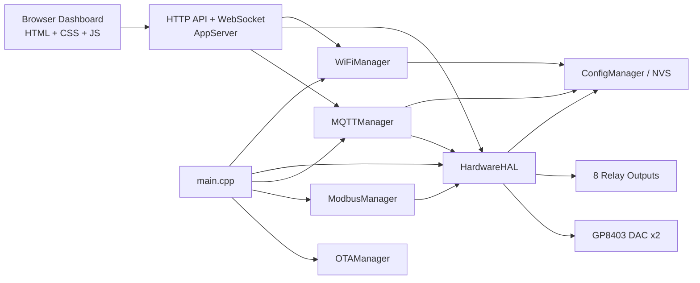

# NOVO ESP Review Copy

ESP32 firmware and embedded web dashboard for an industrial-style monitoring and control panel inspired by the Siemens SICHARGE D interface.

This repository combines:
- ESP32 firmware built with PlatformIO and Arduino
- An embedded dashboard served from SPIFFS
- Real-time control over WebSocket
- Integration layers for MQTT, Modbus TCP and OTA
- Browser-based E2E coverage with Cypress and Playwright

## Overview

The project drives an ESP32-based controller with:
- 8 relay outputs grouped by functional area
- 2 DAC channels for analog voltage control
- Wi-Fi STA/AP management with fallback behavior
- A browser dashboard for operations, diagnostics and configuration
- Persistent settings stored in NVS

The current dashboard intentionally follows a denser, more professional industrial HMI style instead of a generic consumer web app layout.

## Dashboard Preview

Animated dashboard preview:


Main operator dashboard:


## Main Features

### Firmware
- Modular C++ architecture split by responsibility
- Persistent configuration through `Preferences` / NVS
- OTA update support
- MQTT client integration
- Modbus TCP server integration
- Real-time WebSocket command channel
- Wi-Fi provisioning and status endpoints
- Validation for relay and DAC control commands

### Dashboard
- Embedded frontend served directly by the ESP32
- Industrial-style control layout
- Real-time relay status and DAC readout updates
- Wi-Fi scan and provisioning flow
- Security settings panel for credential updates
- Event log panel with clear/export actions
- Responsive behavior for desktop and smaller screens

### Testing
- Cypress suite for safe local UI validation with mocked device APIs
- Playwright E2E entry point for broader browser automation
- Integrated Cypress flow covering relays, DAC updates and DAC ramp in a single scenario

## Security Notes

This copy includes hardening work compared with the original project:
- WebSocket control flow requires authentication before accepting commands
- Wi-Fi credential save handling is safer for fragmented request bodies
- Admin credentials and OTA password are stored in persistent configuration
- Frontend no longer relies on hardcoded JavaScript-only protection

Default credentials may still exist on a fresh device image. Change them after first boot.

## Tech Stack

- ESP32 DevKit / `esp32dev`
- PlatformIO
- Arduino framework
- SPIFFS for embedded web assets
- `ESPAsyncWebServer`
- `AsyncTCP`
- `ArduinoJson`
- `PubSubClient`
- `WebSockets`
- `modbus-esp8266`
- Cypress
- Playwright

## Project Structure

```text
.
|-- data/                Embedded frontend assets
|   |-- index.html
|   |-- styles.css
|   `-- app.js
|-- src/
|   |-- common/          Shared types and constants
|   |-- config/          NVS-backed configuration
|   |-- hardware/        Relay and DAC control
|   |-- modbus/          Modbus TCP integration
|   |-- mqtt/            MQTT integration
|   |-- ota/             OTA support
|   |-- server/          HTTP and WebSocket server
|   |-- wifi/            Wi-Fi lifecycle management
|   `-- main.cpp         Application bootstrap
|-- cypress/             Cypress tests and support files
|-- tests/               Playwright tests
|-- scripts/             Local helper scripts
|-- platformio.ini       Firmware build config
`-- package.json         Frontend test scripts
```

## Architecture



Boot sequence in the current firmware:
1. Start serial diagnostics
2. Load persistent configuration from NVS
3. Restore relay and DAC state through `HardwareHAL`
4. Start Wi-Fi management
5. Start MQTT
6. Start Modbus TCP
7. Start HTTP and WebSocket dashboard services
8. Start OTA

## Getting Started

### 1. Clone the repository

```bash
git clone https://github.com/Canditos/NOVO_ESP_review_copy.git
cd NOVO_ESP_review_copy
```

### 2. Install JavaScript dependencies

```bash
npm install
```

### 3. Build the firmware

```bash
pio run
```

### 4. Upload firmware to the ESP32

```bash
pio run --target upload
```

### 5. Upload the dashboard filesystem

```bash
pio run --target uploadfs
```

## Local Dashboard Preview

You can preview the embedded dashboard locally without connecting to the ESP32 hardware:

```bash
npm run serve:data
```

Then open:

```text
http://127.0.0.1:4173
```

This is the same local server used by the Cypress suite.

## Test Commands

### Cypress

Open the interactive runner:

```bash
npm run cypress:open
```

Run headless:

```bash
npm run cypress:run
```

### Playwright

```bash
npm run test:e2e
```

Headed mode:

```bash
npm run test:e2e:headed
```

## Hardware and Control Scope

### Relay Groups
- Group 1: feedback relays
- Group 2: 24V DC relays
- Group 3: main relays

### DAC Channels
- Channel 1: TF Voltage, nominal range `2.0V - 3.0V`
- Channel 2: Dispenser Temp, nominal range `4.0V - 9.0V`

The dashboard also exposes a stepwise DAC ramp action for channel 2.

## Pin Map

The current firmware pin allocation is defined in [Constants.h](src/common/Constants.h).

| Function | GPIO / Bus | Notes |
| --- | --- | --- |
| Relay 1 | GPIO23 | `DC1 FB` |
| Relay 2 | GPIO32 | `DC2 FB` |
| Relay 3 | GPIO33 | `DC3 FB` |
| Relay 4 | GPIO19 | `DC4 FB` |
| Relay 5 | GPIO18 | `DC1 24V` |
| Relay 6 | GPIO5 | `DC2 24V` |
| Relay 7 | GPIO17 | `MG1 FB` |
| Relay 8 | GPIO16 | `MG2 FB` |
| DAC SDA | GPIO21 | GP8403 I2C data |
| DAC SCL | GPIO22 | GP8403 I2C clock |
| DAC address | `0x58` | GP8403 I2C address |
| ADC1 | GPIO34 | Analog input |
| ADC2 | GPIO35 | Analog input |
| HTTP | Port 80 | Dashboard and REST endpoints |
| WebSocket | Port 81 | Real-time operator commands |
| MQTT | Port 1883 | Default broker port |
| Modbus TCP | Port 502 | Default Modbus service port |

## Configuration and Credentials

The system supports:
- Wi-Fi configuration through the dashboard
- Persistent admin username/password
- Persistent OTA password

If the device is still using default credentials, update them as part of commissioning.

## Technical Docs

- [Cypress testing guide](docs/cypress-testing.md)
- [Wiring notes](docs/wiring.md)
- [Protocol notes](docs/protocols.md)

## Current Status

This repository already includes:
- firmware build fixes
- SPIFFS dashboard refactor into separate HTML/CSS/JS files
- security hardening work
- Cypress coverage for core operator flows
- a more professional dashboard visual language

## Recommended Next Steps

- Add real service health reporting for Modbus and MQTT instead of optimistic UI flags
- Add serial diagnostics and deployment notes to `/docs`
- Add branch protection and CI for Cypress and PlatformIO builds
- Add screenshots and hardware wiring notes for onboarding

## License

No license file is currently included in this repository. Add one before wider distribution if needed.
