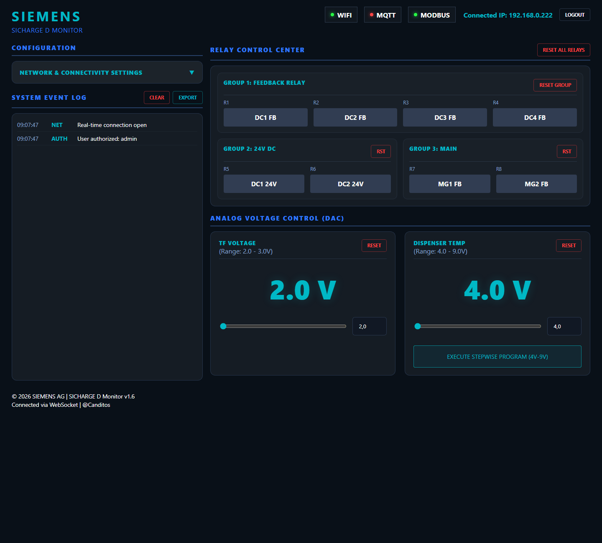
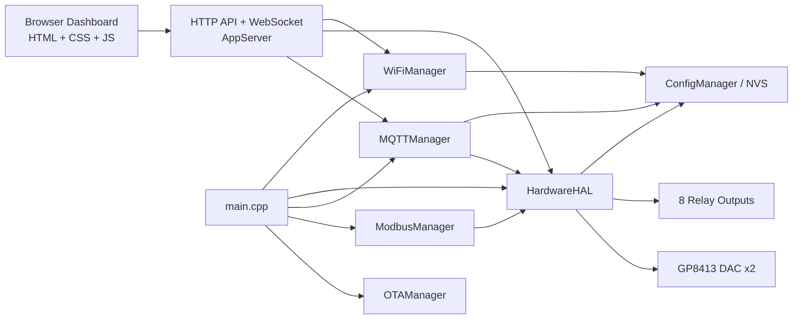

# WELDEDSID_DASHBOARD

**Idiomas:** [English](README.md) | [Portugues](README.pt.md)

Firmware ESP32 e dashboard web embebida para um painel industrial de monitorizacao e controlo inspirado na interface Siemens SICHARGE D.

Este repositorio combina:
- Firmware ESP32 com PlatformIO e Arduino
- Dashboard embebida servida via SPIFFS
- Controlo em tempo real por WebSocket
- Integracao com MQTT, Modbus TCP e OTA
- Cobertura E2E no browser com Cypress e Playwright

## Visao Geral

O projeto controla um sistema baseado em ESP32 com:
- 8 saidas de reles agrupadas por area funcional
- 2 canais DAC para controlo de tensao analogica
- Gestao Wi-Fi STA/AP com fallback
- Dashboard web para operacao, diagnostico e configuracao
- Configuracoes persistentes guardadas em NVS

A dashboard atual segue um estilo HMI industrial mais denso e profissional, evitando um layout generico de app web de consumo.

## Preview da Dashboard

Preview animado:



Dashboard principal:


## Funcionalidades Principais

### Firmware
- Arquitetura C++ modular por responsabilidade
- Configuracao persistente via `Preferences` / NVS
- Suporte a OTA
- Integracao MQTT
- Integracao Modbus TCP
- Canal de comandos em tempo real via WebSocket
- Endpoints de provisionamento e estado Wi-Fi
- Validacao de comandos para reles e DAC

### Dashboard
- Frontend embebido servido diretamente pelo ESP32
- Layout de controlo estilo industrial
- Atualizacoes em tempo real do estado dos reles e valores DAC
- Fluxo de scan e provisionamento Wi-Fi
- Painel de seguranca com roles `admin`, `operator` e `viewer`
- Backup, importacao e reset de configuracoes (admin)
- Painel de logs com acoes de limpar/exportar
- Comportamento responsivo para desktop e ecras menores

### Testes
- Suite Cypress para validacao local da UI com APIs mockadas
- Entrada E2E com Playwright para automacao de browser
- Fluxo Cypress integrado cobrindo reles, DAC e rampas

## Notas de Seguranca

Esta copia inclui hardening face ao projeto original:
- O fluxo de controlo por WebSocket exige autenticacao antes de aceitar comandos
- O handler de credenciais Wi-Fi lida melhor com bodies fragmentados
- Credenciais multi-role e password OTA ficam em configuracao persistente
- Permissoes por role separam acoes de leitura, operador e admin
- O frontend deixou de depender de protecao apenas em JavaScript

Credenciais por defeito podem existir numa imagem nova. Troca-as apos o primeiro arranque.

## Tech Stack

- ESP32 DevKit / `esp32dev`
- PlatformIO
- Arduino framework
- SPIFFS para assets embebidos
- `ESPAsyncWebServer`
- `AsyncTCP`
- `ArduinoJson`
- `PubSubClient`
- `WebSockets`
- `modbus-esp8266`
- Cypress
- Playwright

## Estrutura do Projeto

```text
.
|-- data/                Assets do frontend embebido
|   |-- index.html
|   |-- styles.css
|   `-- app.js
|-- src/
|   |-- common/          Tipos e constantes partilhados
|   |-- config/          Configuracao em NVS
|   |-- hardware/        Controlo de reles e DAC
|   |-- modbus/          Integracao Modbus TCP
|   |-- mqtt/            Integracao MQTT
|   |-- ota/             Suporte OTA
|   |-- server/          Servidor HTTP e WebSocket
|   |-- wifi/            Gestao de ciclo de vida Wi-Fi
|   `-- main.cpp         Bootstrap da aplicacao
|-- cypress/             Testes Cypress e support files
|-- tests/               Testes Playwright
|-- scripts/             Scripts locais
|-- platformio.ini       Configuracao build do firmware
`-- package.json         Scripts de testes frontend
```

## Arquitetura



Sequencia de boot no firmware atual:
1. Iniciar diagnostico serie
2. Carregar configuracao persistente de NVS
3. Restaurar estado de reles e DAC via `HardwareHAL`
4. Iniciar gestao Wi-Fi
5. Iniciar MQTT
6. Iniciar Modbus TCP
7. Iniciar servicos HTTP e WebSocket da dashboard
8. Iniciar OTA

## Primeiros Passos

### 1. Clonar o repositorio

```bash
git clone https://github.com/Canditos/WELDEDSID_DASHBOARD.git
cd WELDEDSID_DASHBOARD
```

### 2. Instalar dependencias JavaScript

```bash
npm install
```

### 3. Compilar o firmware

```bash
pio run
```

### 4. Fazer upload do firmware para o ESP32

```bash
pio run --target upload
```

### 5. Fazer upload do filesystem da dashboard

```bash
pio run --target uploadfs
```

## Preview Local da Dashboard

Podes fazer preview local sem ligar ao ESP32:

```bash
npm run serve:data
```

Depois abre:

```text
http://127.0.0.1:4173
```

Este e o mesmo servidor local usado pela suite Cypress.

## Comandos de Teste

### Cypress

Abrir o runner interativo:

```bash
npm run cypress:open
```

Executar a suite:

```bash
npm run cypress:run
```

Executar a demo em modo headed:

```bash
npm run cypress:demo
```

### Playwright

```bash
npm run test:e2e
```

Modo headed:

```bash
npm run test:e2e:headed
```

## API e Protocolos

Consulta os detalhes em:
- [docs/protocols.md](docs/protocols.md)
- [docs/protocols.pt.md](docs/protocols.pt.md)

## DAC Channels

- Canal 1: TF Voltage, gama nominal `0.0V - 10.0V`
- Canal 2: Dispenser Temp, gama nominal `0.0V - 10.0V`

A dashboard inclui tambem um modo stepwise para o canal 2 ao longo do intervalo 0-10V.

## Pin Map

O mapeamento de pinos atual esta definido em [Constants.h](src/common/Constants.h).

| Funcao | GPIO / Bus | Notas |
| --- | --- | --- |
| Relay 1 | GPIO23 | `DC1 FB` |
| Relay 2 | GPIO32 | `DC2 FB` |
| Relay 3 | GPIO33 | `DC3 FB` |
| Relay 4 | GPIO19 | `DC4 FB` |
| Relay 5 | GPIO18 | `DC1 24V` |
| Relay 6 | GPIO5 | `DC2 24V` |
| Relay 7 | GPIO17 | `MG1 FB` |
| Relay 8 | GPIO16 | `MG2 FB` |
| DAC SDA | GPIO21 | GP8413 I2C data |
| DAC SCL | GPIO22 | GP8413 I2C clock |
| DAC address | `0x58` | GP8413 I2C address |
| ADC1 | GPIO34 | Analog input |
| ADC2 | GPIO35 | Analog input |

## Documentacao Extra

- [docs/apresentacao-projeto.md](docs/apresentacao-projeto.md)
- [docs/apresentacao-projeto.en.md](docs/apresentacao-projeto.en.md)
- [docs/cypress-testing.md](docs/cypress-testing.md)
- [docs/cypress-testing.pt.md](docs/cypress-testing.pt.md)
- [docs/protocols.md](docs/protocols.md)
- [docs/protocols.pt.md](docs/protocols.pt.md)
- [docs/wiring.md](docs/wiring.md)
- [docs/wiring.pt.md](docs/wiring.pt.md)
