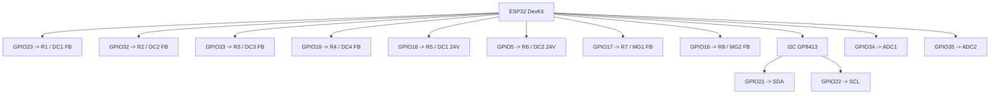

# Wiring Notes

This document summarizes the current pin allocation exposed by the firmware.

## Visual GPIO Map

## Relay Outputs

| Relay | Label | GPIO |
| --- | --- | --- |
| R1 | DC1 FB | GPIO23 |
| R2 | DC2 FB | GPIO32 |
| R3 | DC3 FB | GPIO33 |
| R4 | DC4 FB | GPIO19 |
| R5 | DC1 24V | GPIO18 |
| R6 | DC2 24V | GPIO5 |
| R7 | MG1 FB | GPIO17 |
| R8 | MG2 FB | GPIO16 |

## DAC and Analog

| Function | Value |
| --- | --- |
| DAC device | GP8413 |
| I2C address | `0x58` |
| SDA | GPIO21 |
| SCL | GPIO22 |
| ADC1 | GPIO34 |
| ADC2 | GPIO35 |

## Network and Service Ports

| Service | Port |
| --- | --- |
| HTTP dashboard | `80` |
| WebSocket | `81` |
| MQTT | `1883` |
| Modbus TCP | `502` |

## Commissioning Checklist

- Confirm relay driver polarity before energizing outputs.
- Confirm the GP8413 supply and reference path before writing voltages.
- Validate DAC output ranges with a meter on first boot.
- Change default credentials before connecting the controller to a wider LAN.
- Upload both firmware and SPIFFS content during commissioning.
