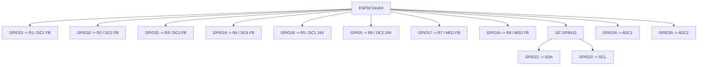

# Notas de Ligacao

**Idiomas:** [Portugues](wiring.pt.md) | [English](wiring.md)

Este documento resume o mapeamento de pinos atual exposto pelo firmware.

## Mapa Visual de GPIO

## Saidas de Reles

| Rele | Label | GPIO |
| --- | --- | --- |
| R1 | DC1 FB | GPIO23 |
| R2 | DC2 FB | GPIO32 |
| R3 | DC3 FB | GPIO33 |
| R4 | DC4 FB | GPIO19 |
| R5 | DC1 24V | GPIO18 |
| R6 | DC2 24V | GPIO5 |
| R7 | MG1 FB | GPIO17 |
| R8 | MG2 FB | GPIO16 |

## DAC e Analogico

| Funcao | Valor |
| --- | --- |
| DAC device | GP8413 |
| I2C address | `0x58` |
| SDA | GPIO21 |
| SCL | GPIO22 |
| ADC1 | GPIO34 |
| ADC2 | GPIO35 |

## Portas de Rede e Servicos

| Servico | Porta |
| --- | --- |
| HTTP dashboard | `80` |
| WebSocket | `81` |
| MQTT | `1883` |
| Modbus TCP | `502` |

## Checklist de Comissionamento

- Confirmar polaridade dos drivers de rele antes de energizar as saidas.
- Confirmar alimentacao e referencia do GP8413 antes de escrever tensoes.
- Validar gamas de saida DAC com multimetro no primeiro arranque.
- Alterar credenciais por defeito antes de ligar o controlador a uma LAN maior.
- Fazer upload do firmware e do SPIFFS durante o comissionamento.
